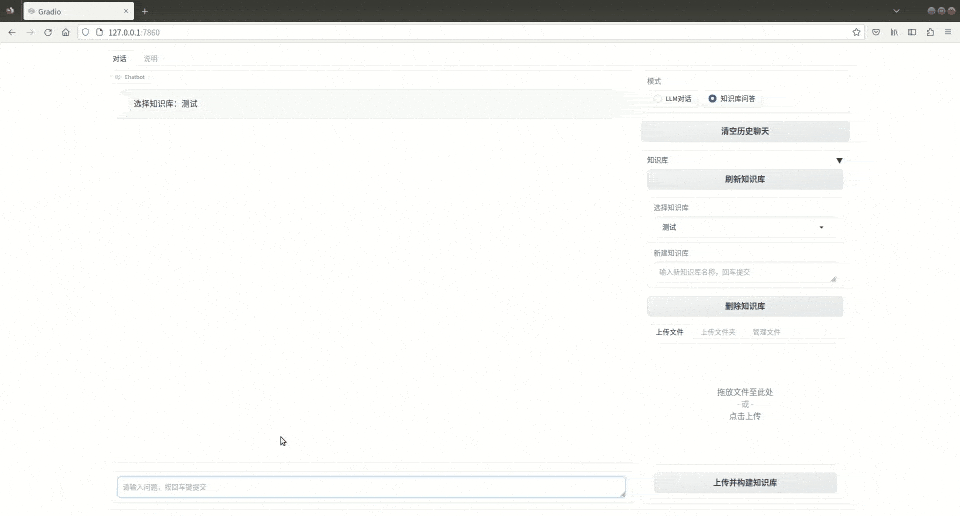

# Simple Local QA
欢迎使用Simple Local QA



演示中所使用的大模型为:chatglm2-6b-int4，显存占用6G

演示中所使用Embedding为:text2vec-large-chinese，项目在编码过程中，采用分批编码，显存占用也控制在6G以内。

## 一. 简介

本项目是本地知识库问答系统的简易版实现，但具有本地知识问答的所有功能。

通过从本项目中，你可以得到：
1. 了解基于大模型的本地知识库的运作原理
2. 了解如何构建一个本地知识库
3. 通过修改少量代码，定制专属于自己的知识库

## 二. 知识库格式
项目数据库由三部分组成：index.faiss，doc.pkl，file.pkl

1. index.faiss  通过faiss存储向量，并计算相似度
2. doc.pkl      列表形式，存储分割后的内容片段
3. file.pkl     集合形式，存储知识库内相关文件的文件名

## 三. 使用
### 1. 克隆项目

```bash
git clone https://github.com/https://github.com/yatengLG/Simple-Local-QA.git
```

### 2. 下载模型

项目通过transformers库载入LLM与Embedding，常见的huggubgface上的大模型基本都支持;也可以自行载入模型。

如需使用其他模型请自行下载即可，

| 模型 | 下载地址 |
|----|----|
| chatglm2-6b-int4 | https://huggingface.co/THUDM/codegeex2-6b-int4/tree/main |
| chatglm2-6b-32k-int4 | https://huggingface.co/THUDM/chatglm2-6b-32k-int4 |
| chatglm2-6b | https://huggingface.co/THUDM/chatglm2-6b/tree/main |
| chatglm2-6b-32k | https://huggingface.co/THUDM/chatglm2-6b-32k/tree/main |
| text2vec-large-chinese | https://huggingface.co/shibing624/text2vec-base-chinese/tree/main |
| 其他模型 | .... |


### 3. 运行

项目目前只提供了web UI调用

运行前，配置模型路径，使用的设备后，执行：
```bash
python webui.py
```

## 四. 改进方向

1. 添加对其他格式文件的支持
2. 对于特定结构的pdf文件，优化读取，可进一步提升问答质量
3. 尝试添加对公式、表格、图片等的支持
